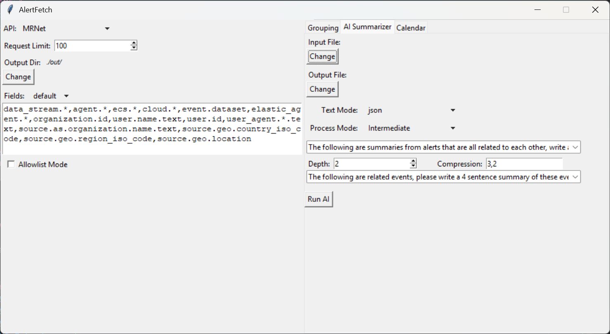

# AlertFetcher
Simple UI for fetching events from an Elastic SIEM and summarizing them using AI.

Originally forked from: https://github.com/IPG5/AlertFetch

## Usage
### Environment
Install required packages with:

```pip install -r requirements.txt```

### Config
#### config.json
`exclude`: dict where the keys are names of lists of fields for use in the `Field Exclusion` pane of the ui

`context_fields`: dict where the keys are names of lists of fields used in the `Context Fields` section of the `Grouping` Pane

`prompts`: list of prompts for use with AI in the `AI Summarizer` pane

#### apis.json
Dict of the form:
```json
{
  "<API_NAME>": {
    "key": "<API KEY>",
    "uri": "<API ENDPOINT>"
  }
}
```
This defines the apis that can be used in the API dropdown.

#### openai.json
Dict containing the details for the OpenAI API the AI summarizer will use.
```json
{
  "api_key": "<API KEY>",
  "base_url": "<API ENDPOINT>"
}
```
*note the base_url should probably end with `/v1`*

### Running

Launch the ui with: ```python ./AF_UI.py```


#### Grouping

The fields menu on the left defines fields that will be included or excluded from the requested events for both grouping
and calendar mode. It is in exclude mode by default, enable 'Allowlist Mode' to switch it to include mode.

'Context Timeframe' defines the amount of time around the event that will be searched for events with fields that match
those defined in 'Context Fields'

#### Calendar

This mode will fetch all events in a timerange and give them a label field for whether the event caused an alert
(1 = alerting, 0 = non alerting). 

Notes:
 * The 'Request Limit' corresponds to the number of events returned by a single request, this mode makes multiple requests which use that limit
 * The events fetched will only be from the index of the alerts source events

#### AI


The AI summarizer takes the output from Grouping or the Calendar mode and can summarize it using a few different modes:

1. Multi Summary &rarr; summarizes each of the events individually then summarizes those summaries
2. Single Summary &rarr; combines all the events into a single prompt and summarizes them
3. Intermediate &rarr; performs multiple multi summaries

*The AI can't handle massive prompts so the intermediate mode is required when dealing with large amounts of data*

The 'Text Mode' defines whether the AI will be prompted with newline seperated data or prettified json.

##### Intermediate Mode

Intermediate mode reveals three new fields:

* The second prompt input defines the prompt to use for intermediate fields
* The 'Depth' field defines the number of intermediate summaries to make
* The 'Compression' field defines the number of alerts to group together for summaries in each of the intermediate steps

For example the to get the configuration of the below intermediate summary would be a depth of `2` with `3,2` as the 
compression.  The depth can be seen from the number of summary 'layers' being 3 which corresponds to `depth + 1`, since depth does 
not include the final summary (meaning that depth=0 is equivalent to a multi summary). The compression can be seen from 
the first set of summaries using **3** events and the second set of summaries using **2** events, thus `3,2` compression.

Note that when the number of events/summaries is not divisible by the compression for a layer the AI will
do a summary on the remainder of the summaries. (eg 5 events with a compression of 3 would summarize a group of 3 events 
and a group of 2 events)


